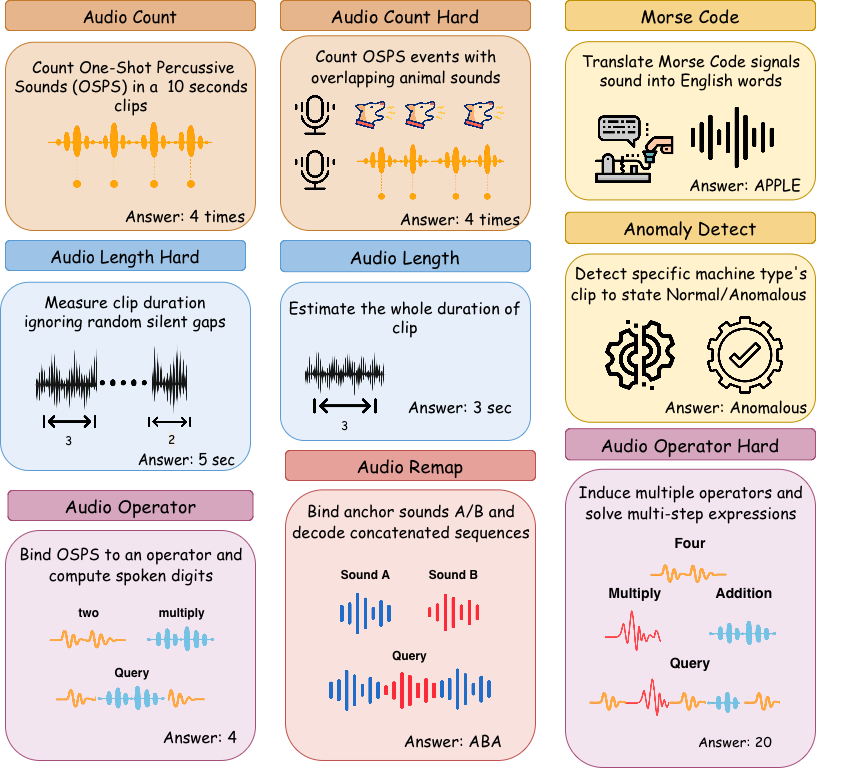

# 🎧 AudioICL-Bench: A Benchmark for In-Context Learning in Audio

- **Authors:** Jia-Hung Chen, Yi-Cheng Lin, Kai-Wei Chang, Ke-Han Lu, Hung-Yi Lee
- **Affiliations:** National Taiwan University, Taiwan; Massachusetts Institute of Technology, USA; NTU AI-CoRE, Taiwan
- **Paper link:** *(coming soon)*

---

## Overview



## Abstract

**TL;DR: We propose AudioICL-Bench, a benchmark for evaluating context-based rule learning (Task Learning) in audio models, and reveal a clear gap between acoustic perception and rule induction in current LALMs.**

Recent advances in large language models demonstrate strong in-context learning, yet it remains unclear whether audio models can learn new rules from contextual examples. Existing audio benchmarks are largely centered on task recognition, lacking rigorous assessment of a model's ability for contextual task learning. We introduce AudioICL-Bench, a benchmark designed to evaluate context-based rule learning in audio models. It includes controlled artificial tasks (e.g., counting, operator inference, dynamic remapping) and real-world scenarios such as Morse code decoding. Many tasks are constructed so that zero-shot performance is insufficient, requiring models to infer task-specific rules from demonstrations. By analyzing performance across varying numbers of examples, we reveal a clear gap between acoustic perception and rule learning, highlighting limitations of current audio models.

**🌟 Key Findings**

- Models can learn symbolic mapping rules from audio demonstrations (Fast Binding), reaching near-perfect accuracy on AudioOperator with sufficient shots.
- Models **consistently fail** at tasks requiring precise temporal measurement (AudioLength, MorseCode), revealing a fundamental temporal resolution bottleneck caused by audio token downsampling.
- Explicit instructions are mandatory — removing them causes catastrophic performance collapse across most tasks.
- Audio ICL is fundamentally harder than text ICL: audio lacks explicit unit boundaries, and temporal patterns span multiple time scales that current models cannot resolve.

---

## Dataset

Our dataset is available on HuggingFace 🤗:

> **[hongzz-18/AudioICL-Bench](https://huggingface.co/datasets/hongzz-18/AudioICL-Bench)**

---

## 🚀 Inference & Evaluation Pipeline

This section describes how to run model inference and compute accuracy for AudioICL-Bench.

### Pipeline Overview

```
Step 1: Inference (eval_*.py)
        → produces *_results_k{k}.jsonl per model per shot

Step 2: Scoring (eval_str.py)
        → reads all jsonl files, computes string-based accuracy
        → produces summary CSV (model, shots, task, accuracy, n)
```

---

### Step 1 — Run Inference

Choose the script corresponding to your model:

| Script | Model |
|---|---|
| `eval_qwen2_audio.py` | Qwen2-Audio-7B-Instruct |
| `eval_qwen25_omni.py` | Qwen2.5-Omni-7B (single GPU) |
| `eval_qwen3_omni.py` | Qwen3-Omni-30B-A3B-Instruct |

**Common arguments (all scripts):**

```bash
python eval_qwen25_omni.py \
  --meta_path   /path/to/meta_dir \      # directory of *_k{k}.jsonl dataset files
  --base_dir    /path/to/data_root \     # root directory for resolving audio paths
  --out_dir     /path/to/output_dir \    # where *_results_k{k}.jsonl will be saved
  --model       Qwen/Qwen2.5-Omni-7B \  # HuggingFace model ID
  --batch_size  4 \
  --max_tokens  16 \
  --gpu_mem_util 0.8 \
  --max_model_len 32768
```

**Multi-GPU (parallel script and Qwen3 only):**

```bash
  --tp 2    # number of GPUs for tensor parallelism
```

**MorseCode task (optional):**

```bash
  --morse_az_dir /path/to/MorseCode/alphabet    # directory containing A.wav ... Z.wav
```

**Output format** — each script appends one line per example to `{out_dir}/{model}_results_k{k}.jsonl`:

```json
{"id": "example_001", "task": "AudioCount", "response": "3", "gt": 3}
```

---

### Step 2 — Compute Accuracy

Run `eval_str.py` to score all inference outputs in a directory:

```bash
python eval_str.py \
  --in     /path/to/output_dir \         # directory containing *_results_k*.jsonl
  --out    /path/to/results/summary.csv \
  --only-model  Qwen2.5-Omni-7B \        # filter by model name (must match filename prefix)
  --prompt-style specific                # label recorded in per-example output (e.g. specific/general/none)
```

**Output summary CSV** (`model, shots, task, accuracy, n`):

```
model,shots,task,accuracy,n
Qwen2.5-Omni-7B,1,AudioCount,0.612500,160
Qwen2.5-Omni-7B,1,AudioLength,0.181250,160
Qwen2.5-Omni-7B,3,AudioCount,0.743750,160
...
```
---

### File Naming Convention

Inference scripts expect dataset files named `*_k{k}.jsonl` (e.g. `meta_k1.jsonl`, `meta_k3.jsonl`).
Output files follow the pattern `{model_name}_results_k{k}.jsonl`, which `eval_str.py` parses automatically.
